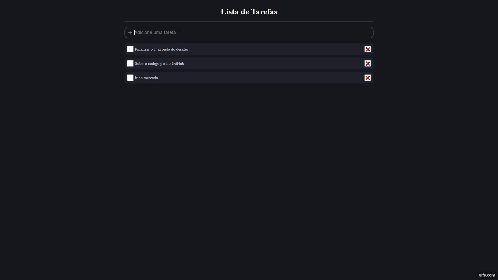

# Lista de Tarefas (Desafio B7Web 5 Em 5)
# Sobre o projeto

O projeto é o primeiro do Desafio 5 em 5 React com Typescript proposto pela <a href="https://b7web.com.br/fullstack/">B7Web</a>. O site é uma lista de tarefas simples onde é possível adicionar, remover e/ou marcar uma tarefa como concluída. 
## Layout
 

## 🚀 Tecnologias Usadas

- ✔️ [React](https://pt-br.reactjs.org/)

- ✔️ [Styled-components](https://styled-components.com/docs/basics#installation)

- ✔️ [TypeScript](https://www.typescriptlang.org/)

